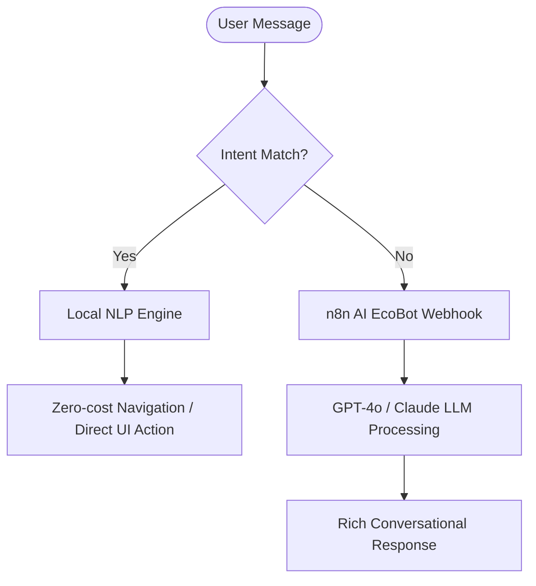

# Hoteleco-Pro: Complete Final Technical Report & System Documentation

This document serves as the comprehensive final technical report and software architecture specification for the **Hoteleco-Pro** system (Final Year Project - FYP). It covers the overarching system architecture, frontend pages, backend machine learning engine, database rules, automation workflows, chatbot logic, and containerised deployment steps in exhaustive detail.

---

## 1. Executive Summary & Problem Statement

### 1.1 Context
In the modern global travel landscape, **Eco-Tourism** and **Sustainable Travel** have transitioned from niche markets to major industry segments. However, tourists encounter significant friction when trying to plan eco-conscious travel in developing nations like Sri Lanka. Traditional booking platforms lack spatial analysis, fail to dynamically calculate accurate local transport pricing, and do not offer personalized itinerary generation based on geographical proximity.

### 1.2 Core Solutions Offered by Hoteleco-Pro
* **Proximity-Based Spatial Search:** Recommends the closest certified eco-hotels to tourist spots and vice versa using a K-NN (K-Nearest Neighbors) algorithm mapped via spherical coordinates.
* **Bespoke Travel Planner (PickATrip Wizard):** A step-by-step assistant calculating real-time flight fares (via Amadeus API), hotel costs, and precise vehicle route pricing based on local rates (Tuk-Tuk, Sedan, SUV, Luxury Van).
* **Serverless Backend Scaling (Firebase + n8n):** Eliminates traditional heavy middleware infrastructure by offloading real-time data sync to Firebase Realtime Database and business workflows to n8n automation pipelines.
* **Dual-Engine Intelligent Chatbot (EcoBot):** Fuses a zero-latency client-side NLP intent parser with a cloud-based LLM routing engine for conversational booking support.

---

## 2. High-Level System Architecture

Hoteleco-Pro employs a **hybrid three-tier architecture** combining client-side single-page applications, asynchronous API servers, serverless real-time document stores, and cloud workflow automations.

```mermaid
graph TD
    subgraph Presentation Layer (React SPA)
        A["React 19 Client UI"] <-->|Real-time Socket Connection| B[("Firebase Realtime DB")]
        A -->|1. Token Matching / Action Chips| C["Local Intent Engine (chatEngine.js)"]
        A <-->|2. LLM Prompt Webhook| D["EcoBot Chatbot Component"]
    end

    subgraph Logic & Computing Layer
        E["FastAPI Python Backend (main.py)"] <-->|Standardizes & Caches| F[("Local CSV Datasets")]
        E <-->|Firestore Listener Daemon| G[("Cloud Firestore")]
        E <-->|HTTPS API queries| H["Amadeus Flight Engine / Simulator"]
        
        I["n8n Automation Engine"] <-->|Webhook Trigger| D
        I <-->|Structured JSON Prompts| J["OpenAI GPT / Claude LLM"]
        I -->|SMTP protocol| K["Email Server"]
        I -->|Google Sheets Node| L["Financial Sheets Ledger"]
    end

    A <-->|HTTP REST / KNN Requests| E
    B <-->|Cloud Sync Pipeline| G
    I <-->|Payment Confirmation Hook| B
```

### 2.1 Layer Breakdown

1. **Presentation Layer (React 19 Frontend):**
   Handles visual layouts, interactive Mapbox GL/Leaflet rendering, forms validation, client-side translation routing, and stores session states.
2. **Computational Logic Layer (FastAPI Backend):**
   Handles space-complexity calculations, builds KD-Tree/BallTree geospatial indexes, runs route pricing equations, and processes flight data.
3. **Storage & Workflow Integration Layer (Firebase & n8n.io):**
   Maintains user accounts, holds real-time records (reviews, live bookings), matches database read/write permissions, registers transaction history, and fires background marketing scripts.

---

## 3. Frontend Architecture & Page Implementations

The frontend of Hoteleco-Pro is structured as a light, high-performance React 19 Single Page Application (SPA). To maintain zero-bundle overhead and maximum performance, it uses state-based routing rather than external React Router modules.

### 3.1 Tech Stack Details
* **React 19 (ES6+):** Utilises Hooks (`useState`, `useEffect`, `useRef`, `useMemo`) for component state lifecycle hooks.
* **Vanilla CSS:** Styled custom design system utilizing premium glassmorphic tokens, CSS variables, backdrop blurs, and Outfit/Playfair Display typography.
* **Mapbox GL & Leaflet:** Renders interactive maps showing GPS markers, distance scales, and customized travel route lines.
* **i18next Integration:** Handles internationalization across 8 core languages (English, Sinhala, Chinese, Hindi, Japanese, Russian, German, French).

### 3.2 Detailed Page File Mapping

| Page/Component | Path | Purpose & Mechanics |
| :--- | :--- | :--- |
| `HomePage` | `src/pages/HomePage.jsx` | Landings portal presenting sustainable tourism branding and direct entry into the travel wizard. |
| `TripPlannerWizard` | `src/pages/TripPlannerWizard.jsx` | Wizard guiding users through selecting flight origins, nights, vehicle selection, and computing E2E estimates. |
| `ItineraryPage` | `src/pages/ItineraryPage.jsx` | Visual itinerary summary plotting daily coordinate stops on Mapbox GL. |
| `MapPage` | `src/pages/MapPage.jsx` | Renders all hotels and destinations in Sri Lanka dynamically, supporting voice navigation alerts. |
| `DestinationsPage` | `src/pages/DestinationsPage.jsx` | Catalog of nature, cultural, and adventure sites with AI recommendation lists. |
| `DestinationProfile` | `src/pages/DestinationProfile.jsx` | Detail page showing site reviews, coordinate stats, and nearest hotels. |
| `HotelsPage` | `src/pages/HotelsPage.jsx` | Portal showing registered eco-resorts sorted by eco-certification level. |
| `HotelProfile` | `src/pages/HotelProfile.jsx` | Detailed layout for booking rooms, reading reviews, and checking local tours. |
| `HotelDashboard` | `src/pages/HotelDashboard.jsx` | Analytics board for hotel managers to trace reservations, revenue metrics, occupancy rates, and review logs. |
| `AdminDashboard` | `src/pages/AdminDashboard.jsx` | Central portal for validating new hotel sign-ups, editing destinations, and system diagnostics. |
| `CustomerAuthPage` | `src/pages/CustomerAuthPage.jsx` | Authenticates tourists via Firebase Auth. |
| `AIChatBot` | `src/components/AIChatBot.jsx` | Floating widget interfacing client NLP with the remote n8n LLM endpoint. |

---

## 4. FastAPI Geospatial Engine & Machine Learning

The backend engine (`main.py`) provides the core machine learning and travel computation capabilities.

### 4.1 Proximity Recommendation Model (Haversine BallTree)
The core challenge in geographic recommendation is computing spherical distances efficiently across high numbers of points. Hoteleco-Pro implements Scikit-Learn's **BallTree** utilizing the **Haversine Metric** to model distance on the Earth's curved surface.

#### Mathematical Foundation (Haversine Formula)
Given two points with coordinates $(\phi_1, \lambda_1)$ and $(\phi_2, \lambda_2)$ in radians (representing Latitude and Longitude):

$$d = 2r \arcsin\left(\sqrt{\sin^2\left(\frac{\Delta \phi}{2}\right) + \cos(\phi_1)\cos(\phi_2)\sin^2\left(\frac{\Delta \lambda}{2}\right)}\right)$$

Where:
* $r = 6371.0\text{ km}$ (average radius of Earth).
* $\Delta \phi = \phi_2 - \phi_1$ (Latitude difference).
* $\Delta \lambda = \lambda_2 - \lambda_1$ (Longitude difference).

The BallTree constructs a hierarchically nested structure of hyperspheres, dividing the dataset. The query search complexity is reduced from $O(N)$ (linear search) to $O(\log N)$ (binary tree query search), enabling near-instantaneous closest-neighbour queries on mobile and desktop frontends.

#### Code Implementation
```python
def build_tree(df: pd.DataFrame) -> Optional[BallTree]:
    if df.empty:
        return None
    # Convert lat/lon degrees to radians for Haversine
    coords = np.radians(df[["Latitude", "Longitude"]].values)
    return BallTree(coords, metric="haversine")
```

### 4.2 Multi-Threaded Sync & Thread-Safety Strategy
Because the backend serves read requests (e.g., matching closest hotels) while simultaneously writing database updates (e.g., adding user-submitted destinations), it employs a thread-safe locking mechanism using Python's `threading.RLock()` (Re-entrant Lock).

```python
_lock = threading.RLock()

def _snapshot():
    """Return a thread-safe, consistent snapshot of global variables."""
    with _lock:
        return destinations_df.copy(), hotels_df.copy(), dest_tree, hotel_tree
```
Whenever Firestore alerts the server that a new destination has been added, the index rebuild processes in a non-blocking background thread (`daemon=True`), preventing any thread lock starvation on user read endpoints.

### 4.3 Key REST Endpoints & Parameters

* **`GET /status`**: Returns health stats, database count, and index boolean build checks.
* **`GET /recommend/hotels?site_name=Sigiriya&top_k=5`**: Queries the `hotel_tree` to fetch the 5 closest hotels to Sigiriya.
* **`GET /recommend/sites?hotel_name=Kandalama&top_k=5`**: Queries the `dest_tree` to find nearest tourist attractions.
* **`POST /add/hotel` & `POST /add/site`**: Validates incoming inputs, saves them to local CSV logs, and queues a model rebuild.
* **`GET /api/airports?country=LK`**: Accesses `airports.csv` to serve lists for flight setups.
* **`GET /api/flights/search`**: Interacts with the **Amadeus API** to query tickets to Colombo (CMB).
* **`POST /api/trip/calculate`**: Executes pricing equations based on vehicle classifications:
  $$\text{Transport Cost} = (\text{Est. Distance} \times \text{Vehicle Rate}) + (\text{Nights} \times \text{Driver Daily Fee})$$

---

## 5. Database Schema & Firebase Security Rules

Firebase Realtime Database handles structured user accounts, bookings, reviews, and hotel metrics.

### 5.1 JSON Database Node Schema
```json
{
  "destinations": {
    "site_id_001": {
      "Name": "Yala National Park",
      "Latitude": 6.3697,
      "Longitude": 81.5204,
      "district": "Hambantota",
      "createdAt": 1721865600000
    }
  },
  "bookings": {
    "booking_id_891": {
      "customerName": "Alice Vance",
      "customerEmail": "alice@gmail.com",
      "hotelId": "hotel_id_102",
      "hotel": "Ella Eco Lodge",
      "checkin": "2026-08-10",
      "checkout": "2026-08-15",
      "totalPrice": 350.00,
      "status": "confirmed",
      "createdAt": 1721896800000
    }
  },
  "hotelProfiles": {
    "hotel_id_102": {
      "hotelName": "Ella Eco Lodge",
      "district": "Badulla",
      "latitude": 6.8722,
      "longitude": 81.0453,
      "description": "Green mountain retreat.",
      "rooms": 12,
      "pricePerNight": 70.00,
      "ecoCertLevel": "Gold"
    }
  },
  "hotelMetrics": {
    "hotel_id_102": {
      "2026-07-25": {
        "revenue": 1400.00,
        "bookings": 4,
        "occupancy": 83.33,
        "updatedAt": 1721912400000
      }
    }
  }
}
```

### 5.2 Firebase Security Rules (`database.rules.json`)
The application enforces strict data segregation and access control at the database layer.

```json
{
    "rules": {
        "destinations": {
            ".read": true,
            ".write": true,
            ".indexOn": ["createdAt", "district"]
        },
        "bookings": {
            ".read": "auth != null",
            ".write": true,
            ".indexOn": ["createdAt", "hotelId", "hotel"]
        },
        "hotelRegistrations": {
            ".read": true,
            ".write": true,
            ".indexOn": ["createdAt", "status", "email"]
        },
        "hotelProfiles": {
            ".read": true,
            ".write": true
        },
        "contactMessages": {
            ".read": "auth != null",
            ".write": true,
            ".indexOn": ["createdAt"]
        },
        "hotelMetrics": {
            ".read": "auth != null",
            ".write": "auth != null",
            "$hotelId": {
                ".indexOn": ["updatedAt"]
            }
        },
        "hotelReviews": {
            ".read": true,
            ".write": true,
            "$hotelId": {
                ".indexOn": ["createdAt"]
            }
        },
        "destinationReviews": {
            ".read": true,
            ".write": true,
            "$destName": {
                ".indexOn": ["createdAt"]
            }
        },
        "agencyRegistrations": {
            ".read": true,
            ".write": true,
            ".indexOn": ["createdAt", "email"]
        },
        "agencyPackages": {
            ".read": true,
            ".write": true,
            ".indexOn": ["createdAt", "agencyId"]
        },
        "hotelFlags": {
            ".read": "auth != null",
            ".write": "auth != null",
            "$hotelId": {
                ".indexOn": ["initializedAt"]
            }
        },
        "customerProfiles": {
            ".read": true,
            ".write": true
        }
    }
}
```

#### Security & Indexing Analysis
* **Public Read Access:** Nodes such as `destinations`, `hotelProfiles`, and reviews are readable by any client (`.read: true`) to ensure seamless search visibility.
* **Protected Administrative Records:** Sensitive customer nodes, system logs, booking trackers, and telemetry dashboards require valid authentication tokens (`.read: "auth != null"`).
* **Search Performance Indexing (`.indexOn`):** Critical columns are indexed to optimize queries. For instance, filtering bookings by `hotelId` or destinations by `district` runs in $O(\log N)$ instead of requiring full database scans.

---

## 6. n8n Workflow Automations

Hoteleco-Pro leverages **n8n.io** to execute complex workflows asynchronously without bogging down the main client application threads.

### 6.1 Booking Validation & SMTP Email Auto-Dispatch
1. Tourist processes a booking on `BookingPage.jsx`.
2. Client posts payload parameters to the n8n Webhook: `https://n8n.yourdomain.com/webhook/booking-handler`.
3. n8n appends the booking record directly to the master Google Sheet ledger for offline financial logging.
4. An HTML email template generator constructs a visual receipt containing check-in guidelines, green travel tips, and a QR confirmation code, sending it via SMTP.

### 6.2 Seasonal & Weather-Driven Marketing Advisor
1. Cron Trigger wakes the workflow every morning at 8:00 AM.
2. An HTTP Request pulls local weather forecast metrics (via OpenWeatherMap API) for hotels based on their registered GPS coordinates.
3. An IF conditional node evaluates current rainfall/wind conditions:
   * **If Wet/Rainy:** Sends recommendations to the hotel manager's Slack/Email, suggesting they promote indoor spa services, traditional tea ceremonies, or cooking classes.
   * **If Sunny:** Recommends promoting outdoor hiking excursions, beach activities, or wildlife safari packages.

### 6.3 Automated Monthly PDF Financial Reports
1. Cron Trigger executes at midnight on the 1st of every month.
2. Queries the Firebase Realtime Database node `hotelMetrics` to calculate occupancy and revenue sums for the previous month.
3. Generates a formatted HTML document, passes it to a PDF compiler API, and emails the PDF directly to the hotel manager's registered email address.

---

## 7. Chatbot Engine (Local NLP + Cloud LLM)

To balance immediate response times and computational cost, Hoteleco-Pro employs a hybrid chatbot strategy.



1. **Local NLP Intent Engine (`chatEngine.js`):**
   * Tokenises inputs and scores keywords.
   * If a user asks "how do I book a room?" or "show me the map", it immediately triggers frontend UI state routing, navigating the user to the correct page without making API calls.
2. **Cloud-Based n8n EcoBot:**
   * If local matching scores fall below a minimum confidence threshold, the message is routed to an LLM.
   * The LLM generates a personalized response, recommending travel plans and providing eco-tourism suggestions.

---

## 8. Deployment & Containerisation

To ensure reproducibility, Hoteleco-Pro is fully containerized using **Docker** and **Docker Compose**.

### 8.1 Docker Compose Configuration (`docker-compose.yml`)
```yaml
version: '3.8'

services:
  backend:
    build:
      context: .
      dockerfile: Dockerfile
    ports:
      - "8000:8000"
    environment:
      - PORT=8000
      - AMADEUS_CLIENT_ID=YOUR_REAL_ID
      - AMADEUS_CLIENT_SECRET=YOUR_REAL_SECRET
    restart: always

  frontend:
    build:
      context: ./hotelecopro
      dockerfile: Dockerfile
    ports:
      - "80:80"
    depends_on:
      - backend
    restart: always
```

### 8.2 Production Optimisations
* **FastAPI Backend:** Built on a lightweight `python:3.10-slim` image using multi-stage builds.
* **React Frontend:** Compiled to optimized production bundles (`npm run build`) and served via a high-performance **Nginx** container configured with caching rules.

---

## 9. Quickstart Installation Guide

### 9.1 Launching the Backend API
```bash
# Initialize Python Virtual Environment
python -m venv .venv
source .venv/bin/activate  # On Windows use: .venv\Scripts\activate

# Install required dependencies
pip install -r requirements.txt

# Run server with hot-reloading disabled in production
python main.py
```
*Access API documents at: `http://localhost:8000/docs`*

### 9.2 Launching the Frontend Client
```bash
cd hotelecopro
# Clean install package tree
npm install --legacy-peer-deps

# Create and populate environment secrets (.env)
echo "REACT_APP_FIREBASE_API_KEY=your_key" > .env

# Run local development server
npm start
```
*Access React app at: `http://localhost:3000`*

### 9.3 E2E Orchestrated Container Deployment
To compile and run all services in detached production mode with a single command:
```bash
docker-compose up --build -d
```
