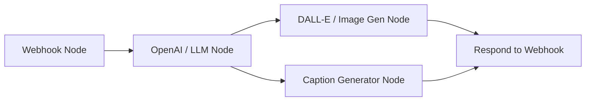

# Step-by-Step Guide: n8n Marketing Generator Backend Setup

This document provides step-by-step instructions to create the backend workflow in n8n for the **Custom AI Marketing Generator** inside the HotelEco Pro Partner Portal.

---

## Workflow Overview
The n8n workflow will receive custom marketing requirements from the hotel dashboard via a webhook, generate a tailored promotional image (using DALL-E/Stable Diffusion), write a matching social media caption (using GPT-4/Claude), and return both to the dashboard in a single JSON response.



---

## Steps to Build the n8n Workflow

### Step 1: Create a Webhook Node (Trigger)
1. In n8n, add a **Webhook** node to start your workflow.
2. Configure the webhook settings:
   - **HTTP Method:** `POST`
   - **Path:** `marketing-generator`
   - **Authentication:** `None` (or matching tokens if you want to secure it)
   - **Respond:** `Using 'Respond to Webhook' node` (this is critical so that the React frontend can receive the generated image and caption synchronously).
3. Save the workflow and copy the **Test URL** (use the Test URL for debugging, then switch to the Production URL once live).

### Step 2: Extract Form Data
When the frontend clicks "Generate", it sends a JSON payload with the following fields:
```json
{
  "hotelName": "Example Eco Resort",
  "district": "Galle",
  "hotelType": "Boutique Hotel",
  "promoType": "Poster",
  "promoGoal": "Seasonal Discount",
  "promoStyle": "Modern Coastal",
  "promoTone": "Elegant",
  "promoDetails": "Promote our new oceanfront spa packages with a 20% discount."
}
```

### Step 3: Add an OpenAI Node (Create Flyer/Poster Design Prompt & Aligned Caption)
Add an **OpenAI** node (or Anthropic/Gemini node) to generate the promotional flyer/poster design prompt and a matching caption based on the customer's UI input.
1. **Model:** `gpt-4o` or `gpt-4o-mini`.
2. **System Prompt:**
   ```text
   You are an expert AI Creative Director and Marketing Strategist specializing in hotel promotion, travel flyers, and digital poster design for Sri Lanka Tourism. 

   Your mission is to take hotel details and customer campaign requests from the UI, and generate TWO perfectly aligned, separate outputs inside a structured JSON object:

   1. "flyerDesignPrompt": An ultra-detailed visual prompt for generating high-impact promotional flyers, posters, or digital ad banners using AI image generators (DALL-E 3 / Midjourney).
      - FLYER / POSTER CONCEPT: Tailored specifically to the requested asset format (Flyer, Poster, Banner, Instagram Story/Reel).
      - VISUAL LAYOUT & COMPOSITION: Eye-catching focal point (e.g. luxury infinity pool, serene eco-villa, ocean view, tea plantation), high-end hospitality editorial layout, 8K photorealistic quality, elegant framing matching the hotel style.
      - BRAND & ATMOSPHERE: Captures Sri Lankan natural beauty, golden hour lighting, lush greenery, and luxury aesthetic.
      - NO BLURRY TEXT OVERLAYS: Pure photographic & graphic composition without messy AI text/watermarks.

   2. "socialMediaCaption": A compelling, high-converting caption designed to accompany the specific flyer/poster image on social media.
      - PERFECT ALIGNMENT: Must directly reflect the visual concept of the flyer/poster AND all details supplied by the customer (Hotel Name, District, Promo Offer/Goal, Tone).
      - HOOK: Captivating headline with engaging emojis.
      - VALUE & PROMOTION: Clear narrative of the offer/experience highlighted in the flyer.
      - CALL TO ACTION (CTA): Direct booking prompt (e.g. "Reserve your stay today via link in bio!").
      - HASHTAGS: Targeted Sri Lanka tourism and luxury hotel hashtags.

   CRITICAL FORMAT REQUIREMENT:
   Output ONLY a raw, valid JSON object containing these two fields:
   {
     "flyerDesignPrompt": "...",
     "socialMediaCaption": "..."
   }
   ```
3. **User Prompt:**
   ```text
   Customer UI Requirements for Promotional Flyer/Poster & Caption:

   [HOTEL INFORMATION]
   • Hotel Name: {{ $json.body.hotelName }}
   • District / Location: {{ $json.body.district }}, Sri Lanka
   • Hotel Type: {{ $json.body.hotelType }}

   [PROMOTIONAL FLYER / POSTER SPECIFICATIONS]
   • Desired Asset Type: {{ $json.body.promoType }} (e.g., Poster, Flyer, Banner, Story)
   • Campaign Goal / Offer: {{ $json.body.promoGoal }}
   • Visual Style & Aesthetic: {{ $json.body.promoStyle }}
   • Brand Tone of Voice: {{ $json.body.promoTone }}
   • Custom Details & Requirements: {{ $json.body.promoDetails }}

   Generate the JSON containing the separate "flyerDesignPrompt" and "socialMediaCaption".
   ```
4. Set the node output structure to parse as JSON.

### Step 4: Add an Image Generation Node (DALL-E 3 for Flyer Visual)
Add a **DALL-E** node (under OpenAI) or a **Stability AI** node to create the visual asset for the flyer/poster.
1. **Action:** `Generate Image`
2. **Prompt:** Map the flyer prompt output from the previous node: `{{ $json.flyerDesignPrompt }}`
3. **Size:** 
   - `1024x1024` for Square Posters / Feed Graphics
   - `1024x1792` for Vertical Flyers / Story Posters
4. **Style:** Natural or Vivid.

### Step 5: Separate JSON Outputs & Respond to Webhook
To split the OpenAI AI Agent output into two distinct JSON items/objects (one for `flyerDesignPrompt` and one for `socialMediaCaption`):

1. **Add an n8n Code Node (JavaScript)**
   Place an **n8n Code Node** right after your OpenAI text node to extract and split the output into 2 distinct JSON items:

   ```javascript
   // n8n Code Node: Bulletproof AI Agent Output Extractor
   const itemJson = $input.item.json;

   // 1. Extract raw text from ALL possible n8n AI Agent fields (.output, .text, .message.content)
   let rawText = "";
   if (typeof itemJson === 'string') {
     rawText = itemJson;
   } else if (itemJson.output) {
     // n8n AI Agent / LangChain nodes store result in .output
     rawText = typeof itemJson.output === 'string' ? itemJson.output : JSON.stringify(itemJson.output);
   } else if (itemJson.text) {
     rawText = itemJson.text;
   } else if (itemJson.message?.content) {
     rawText = itemJson.message.content;
   } else if (itemJson.response) {
     rawText = itemJson.response;
   } else {
     rawText = JSON.stringify(itemJson);
   }

   // 2. Clean markdown code fences (```json ... ```) and parse JSON
   let parsedData = {};
   let cleanText = rawText.replace(/```json/gi, '').replace(/```/g, '').trim();

   try {
     parsedData = JSON.parse(cleanText);
   } catch (e) {
     const match = cleanText.match(/\{[\s\S]*\}/);
     if (match) {
       try { parsedData = JSON.parse(match[0]); } catch (err) {}
     }
   }

   // Direct fallback if itemJson is already parsed
   if (!parsedData.flyerDesignPrompt && itemJson.flyerDesignPrompt) {
     parsedData.flyerDesignPrompt = itemJson.flyerDesignPrompt;
   }
   if (!parsedData.socialMediaCaption && itemJson.socialMediaCaption) {
     parsedData.socialMediaCaption = itemJson.socialMediaCaption;
   }

   // 3. Extract the two fields
   const flyerPrompt = parsedData.flyerDesignPrompt || parsedData.imagePrompt || "";
   const captionText = parsedData.socialMediaCaption || parsedData.caption || "";

   // 4. Return 2 separate items with uniform schema ('itemType' & 'content') for clean n8n Table view
   return [
     {
       json: {
         itemType: "flyerDesignPrompt",
         content: flyerPrompt
       }
     },
     {
       json: {
         itemType: "socialMediaCaption",
         content: captionText
       }
     }
   ];
   ```

2. **Option A: Webhook Response with Both Objects (Recommended for React Dashboard)**
   In the **Respond to Webhook** node, configure the response body as:
   ```json
   {
     "flyer": {
       "imageUrl": "{{ $node[\"DALL-E Image Gen\"].binary.data.url }}",
       "designPrompt": "{{ $node[\"OpenAI Text Gen\"].json.flyerDesignPrompt }}"
     },
     "caption": {
       "text": "{{ $node[\"OpenAI Text Gen\"].json.socialMediaCaption }}"
     }
   }
   ```

3. **Option B: Return an Array of 2 Separate JSON Files/Objects to Webhook**
   In the **Respond to Webhook** node, set **Response Mode** to `JSON Array`:
   ```json
   [
     {
       "fileType": "flyer_design_prompt",
       "content": "{{ $node[\"OpenAI Text Gen\"].json.flyerDesignPrompt }}"
     },
     {
       "fileType": "social_media_caption",
       "content": "{{ $node[\"OpenAI Text Gen\"].json.socialMediaCaption }}"
     }
   ]
   ```

---

## Connecting to HotelEco Pro
1. Paste the copied n8n Webhook URL into the `.env` file of your project:
   ```env
   REACT_APP_N8N_MARKETING_WEBHOOK_URL="https://ceylonnature.app.n8n.cloud/webhook-test/marketing-generator"
   ```
2. Restart your React dev server.
3. Open the **Social Media** tab in your Hotel Dashboard, click **AI Custom Generator**, fill out the details, and test!
