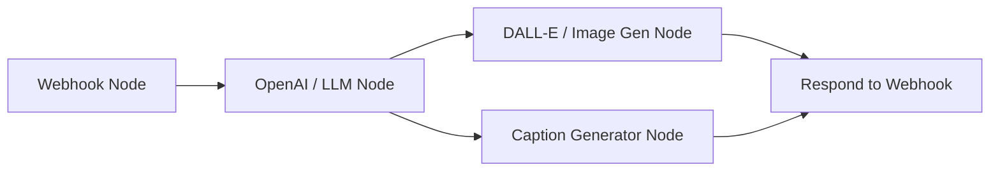

# Step-by-Step Guide: n8n Marketing Generator Backend Setup

This document provides step-by-step instructions to create the backend workflow in n8n for the **Custom AI Marketing Generator** inside the HotelEco Pro Partner Portal.

---

## Workflow Overview
The n8n workflow will receive custom marketing requirements from the hotel dashboard via a webhook, generate a tailored promotional image (using DALL-E/Stable Diffusion), write a matching social media caption (using GPT-4/Claude), and return both to the dashboard in a single JSON response.



---

## Steps to Build the n8n Workflow

### Step 1: Create a Webhook Node (Trigger)
1. In n8n, add a **Webhook** node to start your workflow.
2. Configure the webhook settings:
   - **HTTP Method:** `POST`
   - **Path:** `marketing-generator`
   - **Authentication:** `None` (or matching tokens if you want to secure it)
   - **Respond:** `Using 'Respond to Webhook' node` (this is critical so that the React frontend can receive the generated image and caption synchronously).
3. Save the workflow and copy the **Test URL** (use the Test URL for debugging, then switch to the Production URL once live).

### Step 2: Extract Form Data
When the frontend clicks "Generate", it sends a JSON payload with the following fields:
```json
{
  "hotelName": "Example Eco Resort",
  "district": "Galle",
  "hotelType": "Boutique Hotel",
  "promoType": "Poster",
  "promoGoal": "Seasonal Discount",
  "promoStyle": "Modern Coastal",
  "promoTone": "Elegant",
  "promoDetails": "Promote our new oceanfront spa packages with a 20% discount."
}
```

### Step 3: Add an OpenAI Node (Create Image Prompt & Caption)
Add an **OpenAI** node (or your preferred LLM node like Anthropic or Google Gemini) to generate both the image prompt and the marketing caption.
1. **Model:** `gpt-4o` or similar.
2. **System Prompt:**
   ```text
   You are an expert AI Marketing Assistant for Sri Lanka Tourism. Your task is to take a hotel's campaign requirements and output a JSON object containing two fields:
   1. "imagePrompt": A highly descriptive, detailed prompt for an AI image generator (like DALL-E 3) to create a premium marketing poster/flyer. The prompt should specify style, lighting, composition, and details matching the hotel's style.
   2. "caption": An engaging, high-converting social media caption tailored to the tone of voice and goal. Include relevant emojis and tourism hashtags.
   
   Output ONLY a valid JSON object in this format:
   {
     "imagePrompt": "...",
     "caption": "..."
   }
   ```
3. **User Prompt:**
   ```text
   Hotel Details:
   - Name: {{ $json.body.hotelName }}
   - Location: {{ $json.body.district }}, Sri Lanka
   - Type: {{ $json.body.hotelType }}
   
   Campaign Specifications:
   - Asset Type: {{ $json.body.promoType }}
   - Campaign Goal: {{ $json.body.promoGoal }}
   - Visual Style: {{ $json.body.promoStyle }}
   - Tone of Voice: {{ $json.body.promoTone }}
   - Custom Requirements: {{ $json.body.promoDetails }}
   ```
4. Set the node output structure to parse as JSON.

### Step 4: Add an Image Generation Node (DALL-E 3)
Add a **DALL-E** node (under OpenAI) or a **Stability AI** node to create the visual asset.
1. **Action:** `Generate Image`
2. **Prompt:** Map the output from the previous node: `{{ $json.imagePrompt }}`
3. **Size:** `1024x1024` (or `1024x1792` for story vertical layouts if required)
4. **Style:** Natural or Vivid.
5. *(Optional)* Upload the generated image binary to Cloudinary or Firebase Storage, and get a public URL. If DALL-E returns a public image URL directly, you can pass that URL to the next node.

### Step 5: Add a Respond to Webhook Node
Add a **Respond to Webhook** node to send the results back to the React app.
1. **Response Code:** `200`
2. **Response Body:** Select `JSON`
3. **JSON Structure:**
   ```json
   {
     "imageUrl": "{{ $node[\"OpenAI Image Gen\"].binary.data.url }}", 
     "caption": "{{ $node[\"OpenAI Text Gen\"].json.caption }}"
   }
   ```
   *(Adjust the node names in the variables based on your actual n8n node names).*

---

## Connecting to HotelEco Pro
1. Paste the copied n8n Webhook URL into the `.env` file of your project:
   ```env
   REACT_APP_N8N_MARKETING_WEBHOOK_URL="https://ceylonnature.app.n8n.cloud/webhook-test/marketing-generator"
   ```
2. Restart your React dev server.
3. Open the **Social Media** tab in your Hotel Dashboard, click **AI Custom Generator**, fill out the details, and test!
