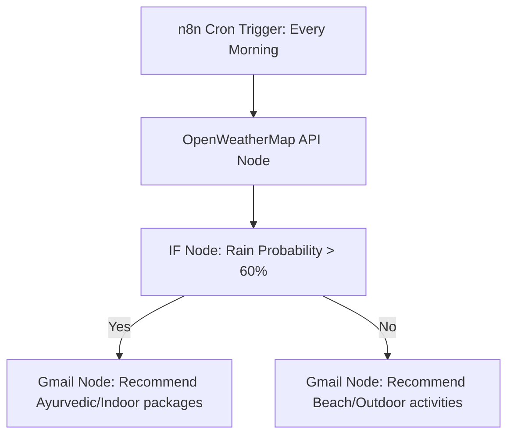

# Ceylon Eco-Tourism Automation Guide: n8n.io Integration

මෙම මාර්ගෝපදේශය (guide) මඟින් හෝටල් ඩෑෂ්බෝඩ් එකෙහි ක්‍රියාකාරකම් (bookings, monsoon weather warnings, report syncs) **n8n.io** හරහා automate කරන ආකාරය පියවරෙන් පියවර (step-by-step) පැහැදිලි කරයි.

---

## 🏗️ 1. n8n.io Workflow Architecture

හෝටලයේ මෙහෙයුම් ස්වයංක්‍රීය කිරීමට (automate) ප්‍රධාන workflows 3ක් සකස් කළ හැක:
1. **Booking Notification Workflow**: අමුත්තෙක් කාමරයක් වෙන්කළ සැණින් විද්‍යුත් තැපැල් (Email confirmation) සහ WhatsApp/SMS පණිවිඩ යැවීම.
2. **Climate & Weather Advisor Workflow**: හෝටලය පිහිටි දිස්ත්‍රික්කයට අනුව කාලගුණ දත්ත ලබාගෙන, මෝසම් සුළං (monsoons) අනුව ඩෑෂ්බෝඩ් එකට seasonal marketing tips යැවීම.
3. **Monthly Financial Report Sync**: සෑම මසකම අවසානයේ හෝටල් දත්ත එකතු කර Excel/Google Sheet එකකට sync කර, PDF වාර්තාවක් හෝටල් හිමියාට විද්‍යුත් තැපැල් කිරීම.

---

## 📋 2. Step-by-Step Implementation

### 🛠️ Workflow 1: Real-time Booking Automation (Gmail & Sheets)

මෙමඟින් `BookingPage.jsx` එකෙන් trigger වන webhook එක ලබාගෙන ක්‍රියාත්මක වේ.

#### පියවර 1.1: Webhook Node එකක් සකස් කිරීම
1. **n8n** dashboard එකට ගොස් **Add Node** ක්ලික් කර **Webhook** සෙවුම් කර තෝරන්න.
2. Webhook settings වල:
   - **HTTP Method**: `POST`
   - **Path**: `booking-trigger` (ඔබ කැමති නමක්)
3. **Webhook URLs** tab එකෙන් **Test URL** එක copy කරගන්න.
   - *Example*: `https://your-n8n-instance.cloud/webhook-test/booking-trigger`
4. React app එකේ `BookingPage.jsx` හි ඇති webhookUrl එකට මෙය paste කරන්න.

#### පියවර 1.2: Listen for Test Event
1. n8n හි **Listen for test event** බොත්තම ක්ලික් කරන්න.
2. React app එකෙන් test booking එකක් සිදු කරන්න.
3. n8n වෙත දත්ත ලැබුණු පසු, JSON format එකෙන් customer data (name, email, checkin, totalPrice) දර්ශනය වේ.

#### පියවර 1.3: Google Sheets Node (Data Sync)
1. **Add Node** ක්ලික් කර **Google Sheets** තෝරන්න.
2. **Resource**: `Row`, **Operation**: `Append`.
3. ඔබගේ Google account එක OAuth2 මඟින් සම්බන්ධ (Connect) කරන්න.
4. දත්ත ඇතුළත් කිරීමට කැමති Spreadsheet එක සහ Sheet name එක තෝරා, Webhook එකෙන් ලැබුණු values map කරන්න:
   - `Name` ➔ `={{ $json.body.customerName }}`
   - `Email` ➔ `={{ $json.body.customerEmail }}`
   - `Hotel` ➔ `={{ $json.body.hotelName }}`
   - `Total` ➔ `={{ $json.body.totalPrice }}`

#### පියවර 1.4: Gmail/SMTP Node (Eco Confirmation Email)
1. **Add Node** ➔ **Gmail** (හෝ SMTP email node).
2. **Operation**: `Send Email`.
3. **To Email**: `={{ $json.body.customerEmail }}`.
4. **Subject**: `🌿 Welcome to {{ $json.body.hotelName }} - Booking Confirmed!`
5. **Body (HTML)**:
   ```html
   <h3>Hello {{ $json.body.customerName }},</h3>
   <p>Thank you for choosing a sustainable eco-stay at <strong>{{ $json.body.hotelName }}</strong>.</p>
   <p><strong>Booking Details:</strong></p>
   <ul>
     <li>Check-in: {{ $json.body.checkin }}</li>
     <li>Total Paid: ${{ $json.body.totalPrice }}</li>
   </ul>
   <p>We look forward to hosting you in Sri Lanka!</p>
   ```

---

### 🌦️ Workflow 2: Climate & Seasonal Marketing Advisor

හෝටල් හිමියාට කාලගුණය සහ මෝසම් සුළං (monsoons) අනුව ඩෑෂ්බෝඩ් එකේ automatic උපදෙස් පෙන්වීම සඳහා.



#### පියවර 2.1: Schedule / Cron Trigger
1. **Cron/Schedule Trigger** node එකක් එක් කරන්න.
2. **Trigger Interval**: `Every Day` at `08:00 AM`.

#### පියවර 2.2: Fetch Weather Data
1. **HTTP Request** node එකක් එක් කරන්න.
2. **Method**: `GET`
3. **URL**: `https://api.openweathermap.org/data/2.5/weather?q=Ella,LK&appid=YOUR_API_KEY` (හෝටලයේ district එක dynamic query parameter එකක් ලෙස යැවිය හැක).

#### පියවර 2.3: Conditional Routing (IF Node)
1. **IF** node එකක් එක් කරන්න.
2. Condition එක සකසන්න: `weather.main` (from HTTP Request) equals `Rain`.

#### පියවර 2.4: Trigger Marketing Recommendations
- **Rainy / Low Season Branch**: හෝටලයට Slack, WhatsApp, හෝ Email මඟින් ස්වයංක්‍රීයව tips යවන්න:
  - *"Weather is rainy in Ella today. Triggering the promotion of indoor wellness packages."*
- **Sunny / Dry Season Branch**: 
  - *"Weather is sunny! Auto-promoting outdoor hiking and outdoor dining packages."*

---

### 📈 Workflow 3: Monthly Analytics & PDF Report Sync

#### පියවර 3.1: Trigger
- **Cron node**: `On the 1st of every month`.

#### පියවර 3.2: HTTP Request to Firebase
- Firebase REST API එක මඟින් monthly metrics retrieve කරගන්න:
  `GET` ➔ `https://your-firebase-db.firebaseio.com/hotelMetrics/{{ hotelId }}.json`

#### පියවර 3.3: HTML to PDF Generation
1. **HTML to PDF Converter API** node එකක් (उदा. PDFMonkey හෝ HTMLPDF API) එක් කරන්න.
2. Firebase metrics දත්ත HTML template එකකට සකසා PDF එකක් generate කරන්න.

#### පියවර 3.4: Send Email to Admin
- Gmail node එක මඟින් generated PDF file එක attachment එකක් ලෙස හෝටල් අයිතිකරුට විද්‍යුත් තැපැල් කරන්න.

---

## 🚀 3. React Frontend Deployment

n8n webhooks වලට React app එක සම්බන්ධ කිරීම සඳහා `fetch` API එක භාවිතා කළ හැක:

```javascript
const triggerN8nAutomation = async (bookingData) => {
    try {
        await fetch("https://your-n8n-instance.cloud/webhook/booking-trigger", {
            method: "POST",
            headers: {
                "Content-Type": "application/json",
            },
            body: JSON.stringify(bookingData),
        });
        console.log("n8n automation triggered successfully!");
    } catch (error) {
        console.error("n8n integration error:", error);
    }
};
```
