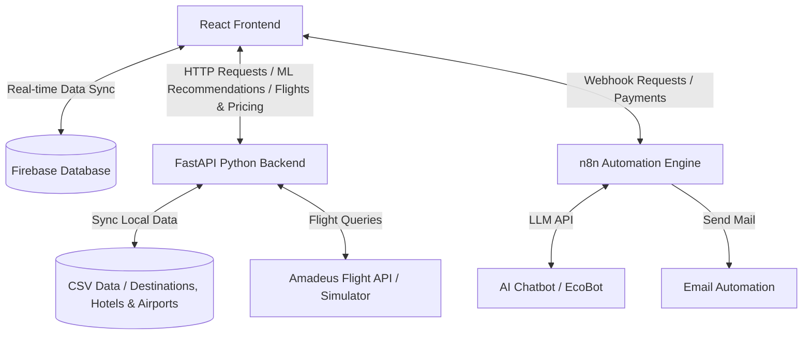

# Hoteleco-pro: Project Summary & Architecture (සාරාංශය)

මෙම ලේඛනය මඟින් Hoteleco-pro ව්‍යාපෘතියේ (Project) සමස්ත ව්‍යුහය, භාවිතා වන තාක්ෂණයන්, නවතම අංග (Features) සහ ක්‍රියාකාරීත්වය පිළිබඳ සාරාංශයක් සපයයි.

---

## 1. High-Level Architecture (පද්ධති ගෘහ නිර්මාණ ශිල්පය)

Hoteleco-pro යනු **Serverless Architecture** සහ **Client-Server Model** එකක් මත පදනම් වූ නවීන වෙබ් යෙදුමකි (Web Application). මෙහි සාම්ප්‍රදායික Backend Server එකක් වෙනුවට **Firebase** (Database & Auth) සහ **n8n.io** (Workflow Automation) භාවිතා කර ඇති අතර, ගණනය කිරීම් සහ Machine Learning නිර්දේශයන් සඳහා **FastAPI Python Backend** එකක් භාවිතා කරයි.

---

## 2. Frontend Architecture (ඉදිරිපස සැකසුම)

Frontend එක සම්පූර්ණයෙන්ම ගොඩනගා ඇත්තේ **React 19** සහ **JavaScript (ES6+)** තාක්ෂණයෙනි.

* **Core Framework:** React 19
* **Styling (CSS):** Vanilla CSS සහ Inline styling (Premium dark/light UX themes සමඟ)
* **Multi-language Support (i18n):** `i18next` සහ `react-i18next` හරහා භාෂා 8ක් සඳහා සහය දක්වයි:
  * 🇬🇧 English, 🇨🇳 中文, 🇮🇳 हिन्दी, 🇯🇵 日本語, 🇷🇺 Русский, 🇩🇪 Deutsch, 🇫🇷 Français, 🇱🇰 සිංහල
* **Maps & Geolocation:** **Mapbox GL** (`mapbox-gl`, `react-map-gl`) සහ **Leaflet** භාවිතයෙන් හෝටල්, සංචාරක ස්ථාන සහ ගමන් මාර්ග (Itinerary Routes) සිතියම් ගත කිරීම සිදු කරයි.
* **ප්‍රධාන පිටු සහ සංරචක (Key Pages & Components - `src/pages/` & `src/components/`):**
  * `HomePage.jsx` - ප්‍රධාන මුල් පිටුව. මෙයට නව "PickATrip" සංචාරක සැලසුම්කරු (Wizard) බොත්තම ඇතුළත් වේ.
  * `TripPlannerWizard.jsx` - PickATrip travel planner wizard එක. පරිශීලකයාගේ මනාප (nights, travel style, vehicle) අනුව ගුවන් ටිකට්පත්, හෝටල් සහ ගමන් වියදම් ගණනය කරයි.
  * `ItineraryPage.jsx` - සකස් කරන ලද සංචාරක සැලැස්ම, දිනෙන් දින විස්තරය, ගුවන් ගමන් සහ හෝටල් වෙන්කිරීම් Map view එකක් සමඟ පෙන්වන පිටුව.
  * `MapPage.jsx` - හෝටල් සහ ගමනාන්ත සිතියම් ගත කිරීමේ පිටුව (Mapbox/Leaflet හරහා).
  * `DestinationsPage.jsx` & `DestinationProfile.jsx` - සංචාරක ස්ථාන නැරඹීම සහ එම ස්ථානවලට ආසන්නතම හෝටල් ML මඟින් නිර්දේශ කිරීම.
  * `HotelsPage.jsx` & `HotelProfile.jsx` - හෝටල් නැරඹීම සහ එම හෝටල් වලට ආසන්නතම සංචාරක ස්ථාන නිර්දේශ කිරීම.
  * `BookingPage.jsx` - පරිශීලකයින්ට හෝටල් වෙන්කරවා ගැනීමේ පිටුව.
  * `CustomerAuthPage.jsx` - පාරිභෝගිකයන් සඳහා Sign-in/Sign-up ද්වාරය.
  * `HotelSigninPage.jsx` & `HotelDashboard.jsx` - හෝටල් හිමියන් සඳහා ලියාපදිංචි වීමේ සහ තොරතුරු/කාමර/සමාලෝචන කළමනාකරණ පිටු.
  * `AdminDashboard.jsx` - පද්ධති පරිපාලක සඳහා පාලක පැනලය (Dashboard).
  * `AIChatBot.jsx` - EcoBot (n8n AI Chatbot) එක වෙබ් අඩවියට සම්බන්ධ කරන floating component එක.

---

## 3. Backend & ML Recommendation API (පසුපස සැකසුම)

පද්ධතියේ Recommendation Engine එක සහ සංචාරක ගණනය කිරීම් Python FastAPI භාවිතයෙන් `main.py` ගොනුව හරහා ක්‍රියාත්මක වේ.

* **Recommendation Algorithm:** **Scikit-learn** හි **BallTree (Haversine metric)** ඇල්ගොරිතමය භාවිතා කරමින්, ස්ථාන දෙකක් අතර භූගෝලීය දුර (Latitude/Longitude) ගණනය කර ආසන්නතම හෝටල් හෝ සංචාරක ස්ථාන නිර්දේශ කරයි.
* **ප්‍රධාන API Endpoints:**
  * `GET /recommend/hotels` - යම් සංචාරක ස්ථානයකට ළඟම ඇති හෝටල් ලැයිස්තුව ලබා දෙයි (Top-K).
  * `GET /recommend/sites` - යම් හෝටලයකට ළඟම ඇති සංචාරක ස්ථාන ලබා දෙයි.
  * `POST /add/hotel` & `POST /add/site` - නව හෝටල්/ස්ථාන index එකට එකතු කිරීම සහ CSV ගොනුවට ලිවීම.
  * `GET /api/airports` - රටක කේතය (Country code) අනුව airports.csv ගොනුවෙන් ගුවන්තොටුපළ ලැයිස්තුව ලබා දේ.
  * `GET /api/flights/search` - **Amadeus Flight Search API** හරහා ශ්‍රී ලංකාවට (CMB) පැමිණෙන ගුවන් ගමන් ගාස්තු සහ විස්තර ලබා දේ (නොබැඳි අවස්ථාවලදී simulated fallback එකක් ක්‍රියාත්මක වේ).
  * `POST /api/trip/calculate` - තෝරාගත් වාහන වර්ගය (tuk-tuk, sedan, suv, luxury-van) සහ දින ගණන අනුව රියදුරු ගාස්තු, කිලෝමීටර ගාස්තු සහ සම්පූර්ණ සංචාරක පිරිවැය ගණනය කර දෙයි.
* **Data Integration:** දේශීය CSV ගොනු (`Destination Site.csv`, `Hotels .csv` සහ `airports.csv`) මෙන්ම Firebase Firestore හි ඇති දත්ත ද්විත්වයම එකතු කර ගනිමින් model එක real-time update කර ගනී.

---

## 4. Database & Automations (Firebase & n8n)

* **Google Firebase:**
  * දත්ත ගබඩා කිරීම සඳහා Firebase Realtime Database සහ Firestore භාවිතා කර ඇත.
  * දත්ත ව්‍යුහය (Data Nodes): `bookings`, `destinations`, `hotelProfiles`, `customers`, `contactMessages`, `hotelReviews`.
* **n8n Automation Engine:**
  * **AI Chatbot (EcoBot):** පරිශීලකයා සහ Chatbot අතර පණිවිඩ n8n webhook හරහා LLM (AI) වෙත යවා ක්ෂණික පිළිතුරු ලබා ගනී.
  * **Email Automation:** නව Booking එකක් සිදු වූ සැනින් පාරිභෝගිකයාට සහ හෝටල් හිමියාට ස්වයංක්‍රීයව තහවුරු කිරීමේ විද්‍යුත් තැපැල් (Emails) යවයි.
  * **Trip Planner Payment Webhook:** සංචාරක සැලසුම් සාර්ථකව ගෙවීම් කිරීමෙන් පසු n8n webhook එකක් හරහා automation ක්‍රියාවලිය සම්පූර්ණ කරයි.
